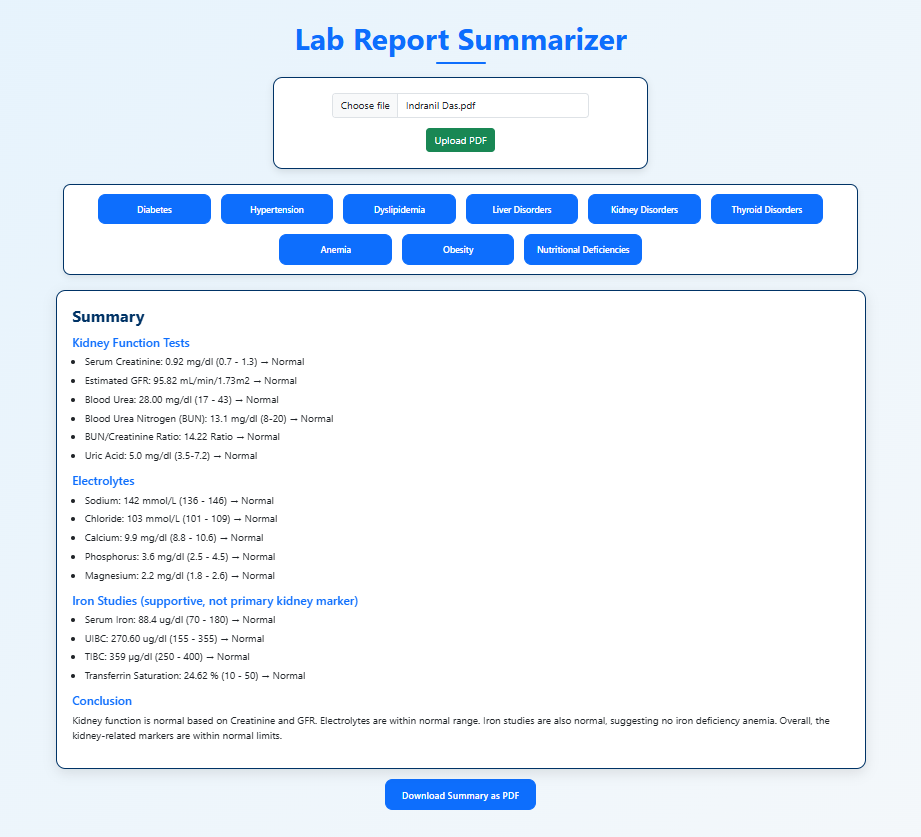

# 🩺 Medical Lab Report Summarizer

<p align="center">
  
</p>

A Flask-based web app that uploads lab test PDFs and generates AI-powered medical summaries (Diabetes, Hypertension, Dyslipidemia, Liver, Kidney, Thyroid, Anemia, Obesity, Nutrition). Supports PDF download of comprehensive summaries.

---

## 🧪 Lab Report Summarizer

A **Flask-based web application** that allows users to upload **lab test PDFs** and get **AI-powered medical summaries** for different health categories such as:

- **Diabetes / Prediabetes**
- **Hypertension**
- **Dyslipidemia**
- **Liver Disorders**
- **Kidney Disorders**
- **Thyroid Disorders**
- **Anemia**
- **Obesity / Metabolic Syndrome**
- **Nutritional Deficiencies**

The app extracts relevant pages from uploaded reports, analyzes them using **Google Gemini (LLM)** and **HuggingFace embeddings**, and generates a **patient-friendly medical summary**. Users can also **download a comprehensive summary PDF**.

---

## 🚀 Features

- 📂 Upload **PDF lab reports**  
- 🤖 Get **AI-powered summaries** for different health categories  
- 📊 Summaries include **reference ranges, values, and interpretations**  
- 🖼️ Clean **Bootstrap UI with dark blue theme**  
- 📑 Download all summaries as a **PDF report**  
- ⚡ Fast response powered by **LangChain + Gemini API + HuggingFace embeddings**  

---

## 🛠️ Tech Stack
- **Backend**: Flask (Python)  
- **Frontend**: Bootstrap 5, Marked.js (Markdown rendering)  
- **AI Models**:  
  - Google Gemini (`gemini-2.0-flash`)  
  - HuggingFace Sentence Transformers (`all-MiniLM-L6-v2`)  
- **Vector Database**: FAISS  
- **PDF Handling**: PyPDF2, ReportLab  
- **Environment Management**: dotenv  

---

## 📂 Project Structure
```

lab-report-summarizer/
│── app.py                  # Flask backend with summarization endpoints
│── templates/
│   └── index.html          # Frontend UI (Bootstrap + JS)
│── requirements.txt        # Python dependencies
│── .env                    # API keys setup

````

---

## ⚙️ Installation

### 1️⃣ Clone the Repository
```bash
git clone https://github.com/Error-Makes-Clever/Medical-Lab-Report-Summarizer.git
cd lab-report-summarizer
````

### 2️⃣ Create Virtual Environment

```bash
python -m venv venv
source venv/bin/activate   # On Linux/Mac
venv\Scripts\activate      # On Windows
```

### 3️⃣ Install Dependencies

```bash
pip install -r requirements.txt
```

### 4️⃣ Setup Environment Variables

Create a `.env` file in the project root:

```env
GOOGLE_API_KEY=your_google_api_key_here
HF_API_TOKEN=your_huggingface_api_token_here
```
---

## 📦 Dependencies

* Flask
* PyPDF2
* python-dotenv
* langchain
* langchain-google-genai
* langchain-huggingface
* FAISS
* ReportLab

Install via:

```bash
pip install -r requirements.txt
```

---

## 🤝 Contributing

Pull requests are welcome! For major changes, open an issue first to discuss what you’d like to change.
